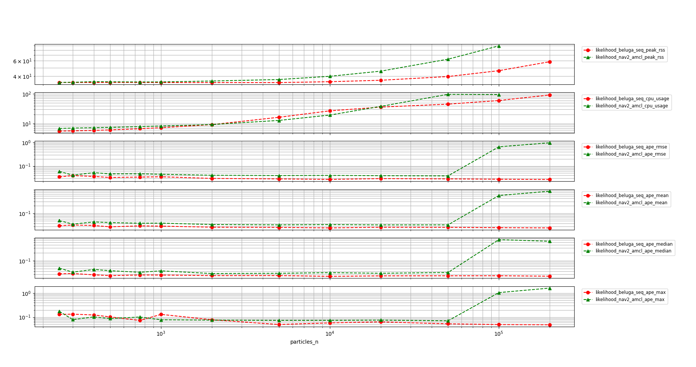
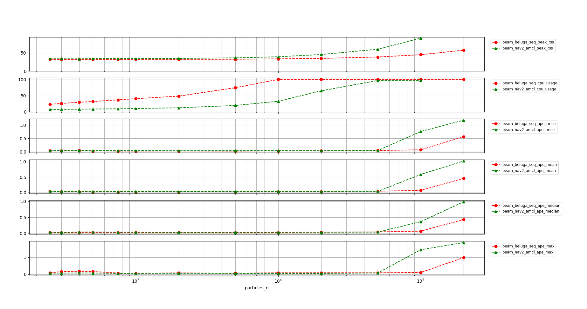

# Beluga AMCL

Beluga AMCL is a ROS 2 node based on the [Beluga](../beluga) library that aims to be fully compatible with the [Navigation 2 AMCL][nav2_amcl] node. 
The compatibility between `beluga_amcl` and `nav2_amcl` provides a simple migration path for projects that want to be able to integrate the power and modularity of the Beluga library in an existing `nav2_amcl`-based project.

## ROS 2 Interface

### Parameters

Beluga AMCL currently supports the majority of ROS parameters used in [Navigation 2 AMCL][nav2_amcl]. 
See [Beluga AMCL parameter reference](docs/PARAMETERS.md) for detailed information.

### Subscribed Topics

The subscribed topic names can be changed with the parameters `map_topic`, `scan_topic` and `initial_pose_topic`.

| Topic            | Type                                      | Description                                                                 |
|------------------|-------------------------------------------|-----------------------------------------------------------------------------|
| `map`            | `nav_msgs/OccupancyGrid`                  | Input topic for map updates.                                                |
| `scan`           | `sensor_msgs/LaserScan`                   | Input topic for laser scan updates.                                         |
| `initial_pose`   | `geometry_msgs/PoseWithCovarianceStamped` | Input topic for pose mean and covariance to initialize the particle filter. |

### Published Topics

| Topic            | Type                                      | Description                                                              |
|------------------|-------------------------------------------|--------------------------------------------------------------------------|
| `particle_cloud` | `nav2_msgs/ParticleCloud`                 | Output topic for particle cloud published at a fixed frequency.          |
| `pose`           | `geometry_msgs/PoseWithCovarianceStamped` | Output topic for estimated pose mean and covariance in map frame.        |

### Transforms

The frame names can be changed with the parameters `global_frame_id`, `odom_frame_id` and `base_frame_id`.
Defaults are `map`, `odom` and `base`.

| Transform         | Description                                                                                        |
|-------------------|----------------------------------------------------------------------------------------------------|
| `odom` to `base`  | Input transform used by motion models and resampling policies.                                     |
| `base` to `laser` | Input transform used to convert laser scan points to base frame.                                   |
| `map` to `odom`   | Output transform calculated from the estimated pose mean and the current _odom-to-base_ transform. |

### Services

| Topic                              | Type             | Description                                                                   |
|------------------------------------|------------------|-------------------------------------------------------------------------------|
| `reinitialize_global_localization` | `std_srvs/Empty` | Request to reinitialize global localization without an initial pose estimate. |

## Performance

 Performance reports are periodically generated and uploaded to track performance improvements and regressions. These reports are generated using a set of scripts in the [beluga_benchmark](../beluga_benchmark) package which can be used to compare the performance of `beluga_amcl` against that of `nav2_amcl` using a synthetic dataset.

The following plot displays the RSS (Resident Set Size), CPU usage and APE (Absolute Pose Error) statistics for both  `beluga_amcl` and `nav2_amcl`, with particle sizes ranging between 250 and 200000 and sensor model `likelihood field`.

The following plot displays the RSS (Resident Set Size), CPU usage and APE (Absolute Pose Error) statistics for both  `beluga_amcl` and `nav2_amcl`, with particle sizes ranging between 250 and 200000 and sensor model `beam`.

Further details can be found in [the reports folder here](../beluga_benchmark/docs/reports/).

## Next Steps

- See [example launch files](../beluga_example) showing how to run Beluga-based nodes.
- See [available benchmarks](../beluga_benchmark) for scripts and comparison with other AMCL implementations.

[nav2_amcl]: https://github.com/ros-planning/navigation2/tree/main/nav2_amcl
[nav2_configuration_guide]: https://navigation.ros.org/configuration/packages/configuring-amcl.html
[fox2001]: https://dl.acm.org/doi/10.5555/2980539.2980632
