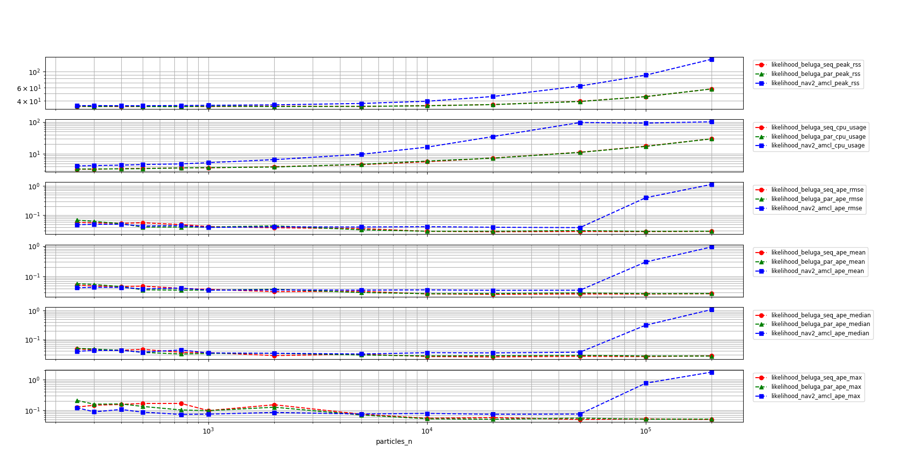
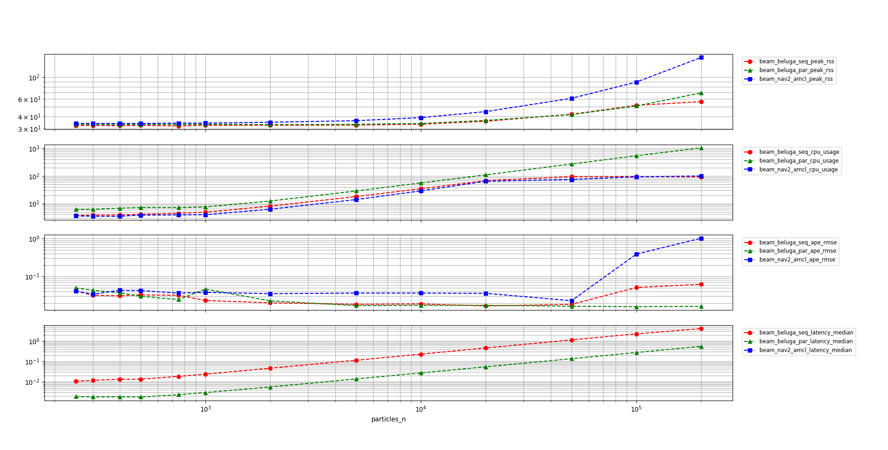

# Beluga AMCL

Beluga AMCL is a ROS node based on the [Beluga](../beluga) library that aims to be fully compatible with the [Navigation 2 AMCL][nav2_amcl] node. 
The compatibility between `beluga_amcl` and its longstanding counterparts in the ROS ecosystem provides a simple migration path for projects that want to be able to integrate the power and modularity of the Beluga library in an existing `nav2_amcl`-based project.

## Table of Contents

- [Beluga AMCL](#beluga-amcl)
  - [Table of Contents](#table-of-contents)
  - [ROS Interface](#ros-interface)
    - [Parameters](#parameters)
    - [Subscribed Topics](#subscribed-topics)
    - [Published Topics](#published-topics)
    - [Published Transforms](#published-transforms)
    - [Advertised Services](#advertised-services)
  - [Performance](#performance)
  - [Next Steps](#next-steps)

## ROS Interface

### Parameters

Beluga AMCL currently supports the majority of ROS parameters used in [Navigation 2 AMCL][nav2_amcl]. 
See [Beluga AMCL documentation](https://ekumen-os.github.io/beluga/packages/beluga_amcl/docs) for further reference.

### Subscribed Topics

The subscribed topic names can be changed with the parameters `map_topic`, `scan_topic`, and `initial_pose_topic`.

| Topic            | Type                                      | Description                                                                 |
|------------------|-------------------------------------------|-----------------------------------------------------------------------------|
| `map`            | `nav_msgs/OccupancyGrid`                  | Input topic for map updates.                                                |
| `scan`           | `sensor_msgs/LaserScan`                   | Input topic for laser scan updates.                                         |
| `initial_pose`   | `geometry_msgs/PoseWithCovarianceStamped` | Input topic for pose mean and covariance to initialize the particle filter. |

Alternatively, and instead of the `scan_topic`, one may set the `point_cloud_topic`. Point clouds are assumed to be contained in a z = constant
plane in the base frame of reference. It is further assumed this plane is the same plane where the map and pose estimates are defined. If this
is not the case, Beluga AMCL will misbehave. It is on the user to filter point clouds and make sure these assumption hold.

### Published Topics

| Topic              | Type                                      | Description                                                              |
|--------------------|-------------------------------------------|--------------------------------------------------------------------------|
| `particle_cloud`   | `geometry_msgs/PoseArray`                 | Output topic for particle cloud poses published at a fixed frequency.    |
| `particle_markers` | `visualization_msgs/MarkerArray`          | Output topic for particle cloud markers published at a fixed frequency.  |
| `likelihood_field` | `nav_msgs/OccupancyGrid`                  | Output topic for likelihood field, published on update when applicable.  |
| `pose`             | `geometry_msgs/PoseWithCovarianceStamped` | Output topic for estimated pose mean and covariance in map frame.        |

### Published Transforms

The frame names can be changed with the parameters `global_frame_id`, `odom_frame_id` and `base_frame_id`.
Defaults are `map`, `odom` and `base`.

| Transform         | Description                                                                                        |
|-------------------|----------------------------------------------------------------------------------------------------|
| `odom` to `base`  | Input transform used by motion models and resampling policies.                                     |
| `base` to `laser` | Input transform used to convert laser scan points to base frame.                                   |
| `map` to `odom`   | Output transform calculated from the estimated pose mean and the current _odom-to-base_ transform. |

### Advertised Services

| Topic                              | Type             | Description                                                                   |
|------------------------------------|------------------|-------------------------------------------------------------------------------|
| `reinitialize_global_localization` | `std_srvs/Empty` | Request to reinitialize global localization without an initial pose estimate. |
| `request_nomotion_update`          | `std_srvs/Empty` | Trigger a forced update of the filter estimates.                              |

## Performance

Performance reports are periodically generated and uploaded to track performance improvements and regressions. These reports are generated using a set of scripts in the [beluga_benchmark](../beluga_benchmark) package which can be used to compare the performance of `beluga_amcl` against that of `nav2_amcl` using a synthetic dataset.

The following plot displays the RSS (Resident Set Size), CPU usage, APE (Absolute Pose Error) and processing latency statistics for both  `beluga_amcl` and `nav2_amcl`, with particle sizes ranging between 250 and 200000 and sensor model `likelihood field`.

The following plot displays the RSS (Resident Set Size), CPU usage, APE (Absolute Pose Error) and processing latency statistics for both  `beluga_amcl` and `nav2_amcl`, with particle sizes ranging between 250 and 200000 and sensor model `beam`.

Further details can be found in [the reports folder here](../beluga_benchmark/docs/reports/).

## Next Steps

- See [example launch files](../beluga_example) showing how to run Beluga-based nodes.
- See [available benchmarks](../beluga_benchmark) for scripts and comparison with other AMCL implementations.

[nav2_amcl]: https://github.com/ros-planning/navigation2/tree/main/nav2_amcl
[nav2_configuration_guide]: https://navigation.ros.org/configuration/packages/configuring-amcl.html
[fox2001]: https://dl.acm.org/doi/10.5555/2980539.2980632
