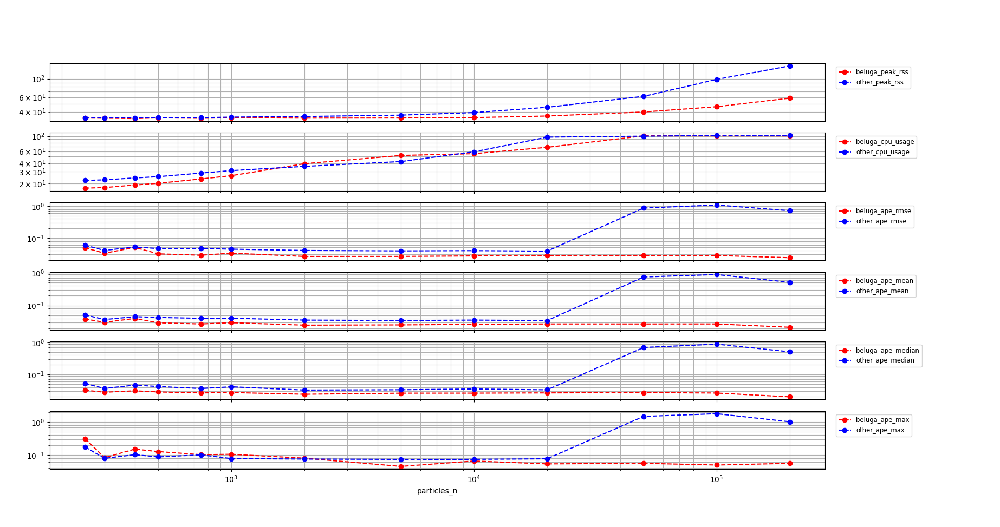
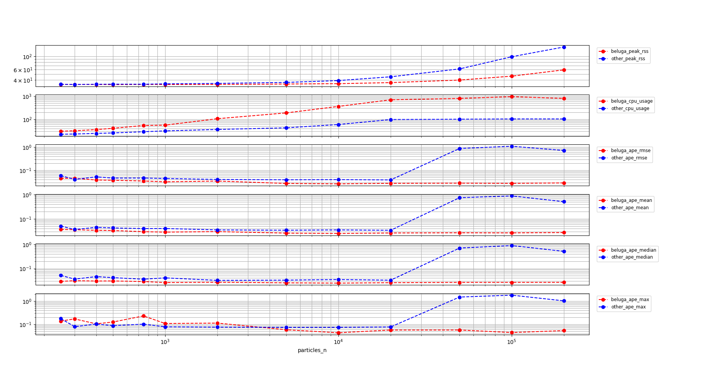
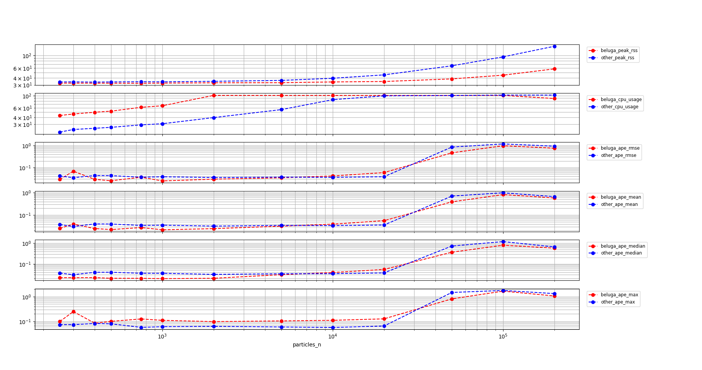
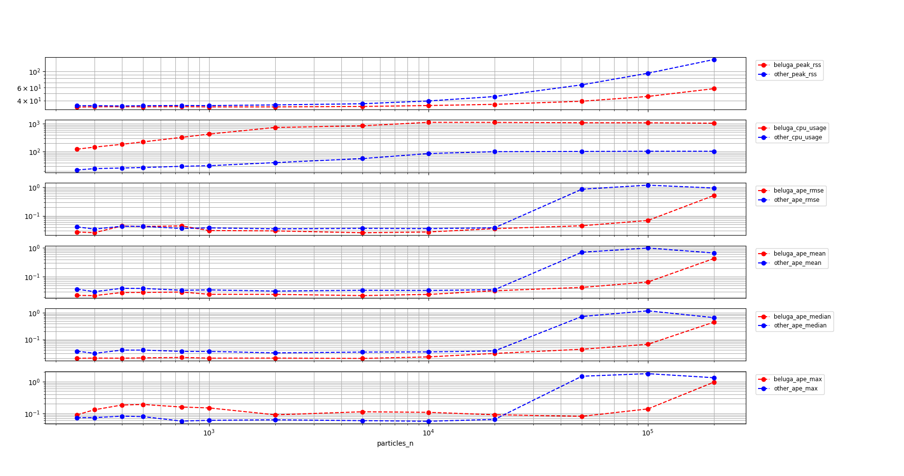

# Performance comparison with nav2_amcl

## Environment details

- CPU: Intel(R) Core(TM) i7-10750H CPU @ 2.60GHz x 6 cores x 2 threads/core
- RAM: 16384 MB
- Host OS: Ubuntu 22.04.2 LTS
- Commit hash: 640c23dd654bd604493d7c98b28625269b123b21

## Experimental setup

The following configuration was used during the experiments:

- The benchmarks were run using 250, 300, 400, 500, 750, 1000, 2000, 5000, 10000, 20000, 50000, 100000 and 200000 particles.
- `beluga_amcl` was run both using multithreaded and non-multithreaded configurations. `nav2_amcl` only provides non-multithreaded execution.
- Both the `beam sensor` and the `likelihood field` sensor model were tested.

More specific configuration details can be found in the `params.yaml` files:

- `nav2_amcl` (likelihood field) uses [likelihood_params.yaml](likelihood_params.yaml)
- `beluga_amcl` (likelihood field, non-multithreaded) uses [likelihood_params.yaml](likelihood_params.yaml)
- `beluga_amcl` (likelihood field, multithreaded) uses [likelihood_params_par.yaml](likelihood_params_par.yaml)
- `nav2_amcl` (beam) uses [beam_params.yaml](beam_params.yaml)
- `beluga_amcl` (beam, non-multithreaded) uses [beam_params.yaml](beam_params.yaml)
- `beluga_amcl` (beam, multithreaded) uses [beam_params_par.yaml](beam_params_par.yaml)

Except for the multithreading and sensor model parameters, the configuration on all of the files is identical.

## Recorded metrics

The following metrics were recorded during each run:

- RSS (Resident Set Size), amount of memory occupied by a process that is held in RAM.
- CPU usage.
- APE (Absolute Pose Error) statistics: `mean`, `median`, `max` and `rmse`.

## Results

#### Non-multithreaded Beluga vs. Nav2 AMCL with Likelihood Field Sensor Model



Commentary on the results:

- Memory usage for `beluga_amcl` grows slower than for `nav2_amcl` throughout the whole range of particle counts.
- `beluga_amcl` has about the same level of CPU usage as `nav2_amcl` under $10^4$ particles. Beyond that point both non-multithreaded implementations saturate near 100% CPU usage.
- The trajectory APE is on par or slightly better for `beluga_amcl` than `nav2_amcl` throughout the whole range of particles. In the CPU saturation region, the localization performance for `nav2_amcl` suddenly degrades while `beluga_amcl` continues to provide some level of service.

#### Multithreaded Beluga vs. Nav2 AMCL with Likelihood Field Sensor Model



Commentary on the results:

- Memory usage for `beluga_amcl` grows slower than for `nav2_amcl` throughout the whole range of particle counts.
- `beluga_amcl` provides consistent APE performance all the way up to $10^5$ particles.
- However, CPU usage for `beluga_amcl` is consistently higher than that for `nav2_amcl` throughout the whole range of particles, even in the region below $2k$ particles.

#### Non-multithreaded Beluga vs. Nav2 AMCL with Beam Sensor Model



- Memory usage for `beluga_amcl` grows slower than for `nav2_amcl` throughout the whole range of particle counts.
- The recorded CPU usage for `beluga_amcl` is higher and saturates earlier than `nav2_amcl` with the `beam sensor` model.
- The APE is similar for both nodes, with both nodes beginning to degrade deep into the CPU saturation region at around $50k$ particles

#### Multithreaded Beluga vs. Nav2 AMCL with Beam Sensor Model



- Memory usage for `beluga_amcl` grows slower than for `nav2_amcl` throughout the whole range of particle counts.
- The recorded CPU usage for `beluga_amcl` is higher and saturates earlier than `nav2_amcl` with the `beam sensor` model.
- The APE is on par for both nodes below $50k$ particles. Beyond this point both nodes degrade, but `nav2_amcl` degrades faster suddenly, while `beluga_amcl` degrades more gradually.

## Conclusions

- `beluga_amcl` provides better memory usage than `nav2_amcl` in all cases.
- In all configurations, `beluga_amcl` provides similar localization error performance to `nav2_amcl`, degrading more gradually in the CPU saturation region.
- CPU usage for `beluga_amcl` is higher than for `nav2_amcl` both for:
  - `beluga_amcl` with the `beam sensor` model.
  - `beluga_amcl` in multithreaded mode.
- These experiments do not account for the reduction in iteration latency brought by multithreading. This is a topic for future work.

## How to reproduce

To replicate the benchmarks, after building and sourcing the workspace, run the following commands from the current directory:

```bash
mkdir beam_beluga_seq
cd beam_beluga_seq
ros2 run beluga_benchmark parameterized_run --initial-pose-y 2.0 250 300 400 500 750 1000 2000 5000 10000 20000 50000 100000 200000  --params-file ../beam_params.yaml
cd -
mkdir beam_beluga_par
cd beam_beluga_par
ros2 run beluga_benchmark parameterized_run --initial-pose-y 2.0 250 300 400 500 750 1000 2000 5000 10000 20000 50000 100000 200000  --params-file ../beam_params_par.yaml
cd -
mkdir beam_nav2_amcl
cd beam_nav2_amcl
ros2 run beluga_benchmark parameterized_run --initial-pose-y 2.0 250 300 400 500 750 1000 2000 5000 10000 20000 50000 100000 200000 --params-file ../beam_params.yaml --package nav2_amcl --executable amcl
cd -
mkdir likelihood_beluga_seq
cd likelihood_beluga_seq
ros2 run beluga_benchmark parameterized_run --initial-pose-y 2.0 250 300 400 500 750 1000 2000 5000 10000 20000 50000 100000 200000  --params-file ../likelihood_params.yaml
cd -
mkdir likelihood_beluga_par
cd likelihood_beluga_par
ros2 run beluga_benchmark parameterized_run --initial-pose-y 2.0 250 300 400 500 750 1000 2000 5000 10000 20000 50000 100000 200000  --params-file ../likelihood_params_par.yaml
cd -
mkdir likelihood_nav2_amcl
cd likelihood_nav2_amcl
ros2 run beluga_benchmark parameterized_run --initial-pose-y 2.0 250 300 400 500 750 1000 2000 5000 10000 20000 50000 100000 200000 --params-file ../likelihood_params.yaml --package nav2_amcl --executable amcl
cd -
```

Once the data has been acquired, it can be visualized using the following commands:

```bash
ros2 run beluga_benchmark compare_results -b beam_beluga_seq/ -o beam_nav2_amcl
ros2 run beluga_benchmark compare_results -b beam_beluga_par/ -o beam_nav2_amcl
ros2 run beluga_benchmark compare_results -b likelihood_beluga_seq/ -o likelihood_nav2_amcl
ros2 run beluga_benchmark compare_results -b likelihood_beluga_par/ -o likelihood_nav2_amcl
```
