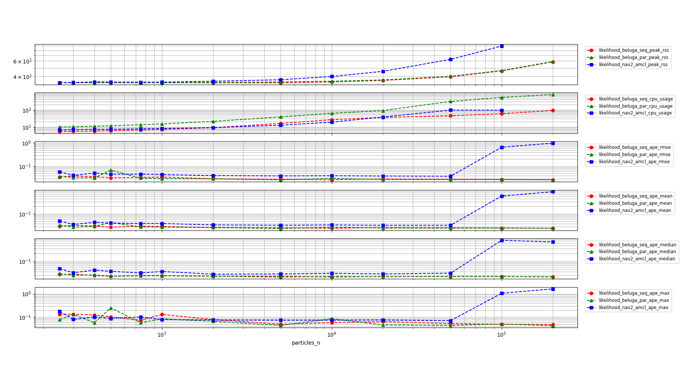
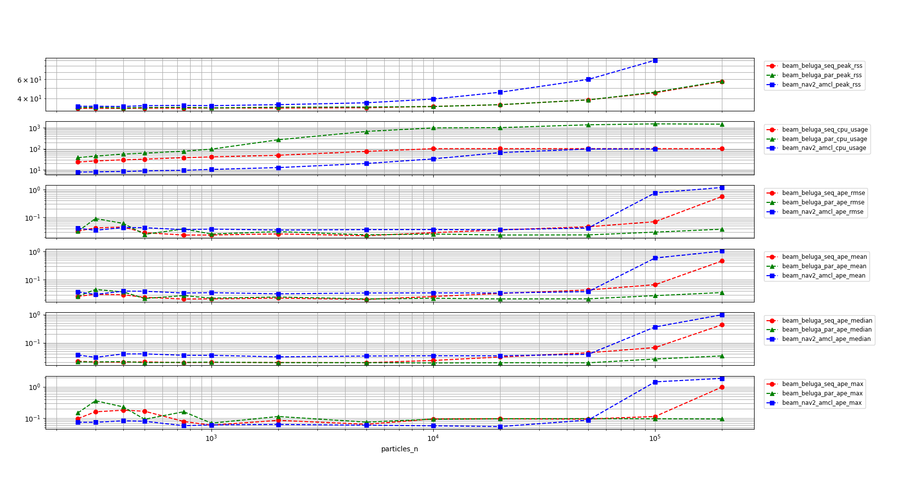

# Performance comparison between beluga_amcl and nav2_amcl

## Environment details

- CPU: **Intel(R) Core(TM) i9-9900 CPU @ 3.10GHz x 16 cores**
- CPU Caches: L1 Data 32 KiB (x8), L1 Instruction 32 KiB (x8), L2 Unified 256 KiB (x8), L3 Unified 16384 KiB (x1)
- RAM: 16384 MB
- Host OS: Ubuntu 22.04.6 LTS
- Commit hash: 9f003ee4855072ef78d58f91ecc1a3a423cac319

## Experimental setup

The following configuration was used during the experiments:

- The benchmarks were run using 250, 300, 400, 500, 750, 1000, 2000, 5000, 10000, 20000, 50000, 100000 and 200000 particles.
- `beluga_amcl` was run both using multithreaded and non-multithreaded configurations. `nav2_amcl` only provides non-multithreaded execution.
- Both the `beam sensor` and the `likelihood field` sensor model were tested.
- The bagfile containing the synthetic dataset was replayed at 1x speed (real time).

More specific configuration details can be found in the `params.yaml` files:

- `nav2_amcl` (likelihood field) uses [likelihood_params.yaml](likelihood_params.yaml)
- `beluga_amcl` (likelihood field, non-multithreaded) uses [likelihood_params.yaml](likelihood_params.yaml)
- `beluga_amcl` (likelihood field, multithreaded) uses [likelihood_params_par.yaml](likelihood_params_par.yaml)
- `nav2_amcl` (beam) uses [beam_params.yaml](beam_params.yaml)
- `beluga_amcl` (beam, non-multithreaded) uses [beam_params.yaml](beam_params.yaml)
- `beluga_amcl` (beam, multithreaded) uses [beam_params_par.yaml](beam_params_par.yaml)

Except for the multithreading and sensor model parameters, the configuration on all of the files is identical.

## Recorded metrics

The following metrics were recorded during each run:

- RSS (Resident Set Size), amount of memory occupied by a process that is held in RAM.
- CPU usage.
- APE (Absolute Pose Error) statistics: `mean`, `median`, `max` and `rmse`.

## Results

#### Beluga vs. Nav2 AMCL using Likelihood Field Sensor Model

In the following graph the results of the benchmark are shown for all three of the tested configurations. The vertical scale is logarithmic to better show the differences between the configurations throughout the whole range of particle counts.



A closer detail of `beluga_amcl` in non-multithreaded configuration and `nav2_amcl` can be seen in the following graph:


Comments on the results:

- The memory usage of `beluga_amcl` (both configurations) is significantly lower than that of `nav2_amcl`.
- The non-multithreaded `beluga_amcl` and `nav2_amcl` perform similarly in terms of CPU usage.
- The multithreaded `beluga_amcl` CPU requirements are higher than both the non-multithreaded `beluga_amcl` and `nav2_amcl`.
- In the CPU saturation region, `nav2_amcl` APE metrics begin to deteriorate significantly, while `beluga_amcl`'s remain stable. In the non-saturation region, the APE of both `beluga_amcl` and `nav2_amcl` is similar with a slight advantage for the former.

#### Non-multithreaded Beluga vs. Nav2 AMCL with Beam Sensor Model

In the following graph the results of the benchmark are shown for all three of the tested configurations when using the Beam Sensor model. The vertical scale is logarithmic to better show the differences between the configurations throughout the whole range of particle counts.



A closer detail of `beluga_amcl` in non-multithreaded configuration and `nav2_amcl` can be seen in the following graph:


Comments on the results:

- `beluga_amcl` in both multithreaded and non-multithreaded configurations uses significantly less memory than `nav2_amcl`.
- On the other hand, both `beluga_amcl` configurations use significantly more CPU than `nav2_amcl` when using the Beam Sensor Model.
- The APE performance of both multithreaded and non-multithreaded `beluga_amcl` is similar to that of `nav2_amcl` throughout the whole range of particle counts, with a slight advantage for the former.

## Conclusions

- `beluga_amcl`'s memory usage is significantly lower than that of `nav2_amcl` in all configurations.
- The Likelihood Field Sensor Model in beluga is about as efficient as that of `nav2_amcl` in terms of CPU usage.
- The Beam Sensor Model, on the other hand, still requires further optimization in order to be competitive with `nav2_amcl` in terms of CPU usage.
- In all configurations `beluga_amcl`'s APE performance is similar to that of `nav2_amcl`.

## How to reproduce

To replicate the benchmarks, after building and sourcing the workspace, run the following commands from the current directory:

```bash
mkdir beam_beluga_seq
cd beam_beluga_seq
ros2 run beluga_benchmark parameterized_run --initial-pose-y 2.0 250 300 400 500 750 1000 2000 5000 10000 20000 50000 100000 200000  --params-file ../beam_params.yaml
cd -
mkdir beam_beluga_par
cd beam_beluga_par
ros2 run beluga_benchmark parameterized_run --initial-pose-y 2.0 250 300 400 500 750 1000 2000 5000 10000 20000 50000 100000 200000  --params-file ../beam_params_par.yaml
cd -
mkdir beam_nav2_amcl
cd beam_nav2_amcl
ros2 run beluga_benchmark parameterized_run --initial-pose-y 2.0 250 300 400 500 750 1000 2000 5000 10000 20000 50000 100000 200000 --params-file ../beam_params.yaml --package nav2_amcl --executable amcl
cd -
mkdir likelihood_beluga_seq
cd likelihood_beluga_seq
ros2 run beluga_benchmark parameterized_run --initial-pose-y 2.0 250 300 400 500 750 1000 2000 5000 10000 20000 50000 100000 200000  --params-file ../likelihood_params.yaml
cd -
mkdir likelihood_beluga_par
cd likelihood_beluga_par
ros2 run beluga_benchmark parameterized_run --initial-pose-y 2.0 250 300 400 500 750 1000 2000 5000 10000 20000 50000 100000 200000  --params-file ../likelihood_params_par.yaml
cd -
mkdir likelihood_nav2_amcl
cd likelihood_nav2_amcl
ros2 run beluga_benchmark parameterized_run --initial-pose-y 2.0 250 300 400 500 750 1000 2000 5000 10000 20000 50000 100000 200000 --params-file ../likelihood_params.yaml --package nav2_amcl --executable amcl
cd -
```

Once the data has been acquired, it can be visualized using the following commands:

```bash
ros2 run beluga_benchmark compare_results \
    -s beam_beluga_seq -l beam_beluga_seq \
    -s beam_beluga_par -l beam_beluga_par \
    -s beam_nav2_amcl  -l beam_nav2_amcl --use-ylog

ros2 run beluga_benchmark compare_results \
    -s beam_beluga_seq -l beam_beluga_seq \
    -s beam_nav2_amcl  -l beam_nav2_amcl --use-ylog

ros2 run beluga_benchmark compare_results \
    -s likelihood_beluga_seq -l likelihood_beluga_seq \
    -s likelihood_beluga_par -l likelihood_beluga_par \
    -s likelihood_nav2_amcl  -l likelihood_nav2_amcl --use-ylog

ros2 run beluga_benchmark compare_results \
    -s likelihood_beluga_seq -l likelihood_beluga_seq \
    -s likelihood_nav2_amcl  -l likelihood_nav2_amcl --use-ylog

ros2 run beluga_benchmark compare_results \
    -s lima_1/likelihood_beluga_seq -l before_likelihood_beluga_seq \
    -s lima_1/likelihood_beluga_par -l before_likelihood_beluga_par \
    -s lima_2/likelihood_beluga_seq -l after_likelihood_beluga_seq \
    -s lima_2/likelihood_beluga_par -l after_likelihood_beluga_par --use-ylog

ros2 run beluga_benchmark compare_results \
    -s lima_1/beam_beluga_seq -l before_beam_beluga_seq \
    -s lima_1/beam_beluga_par -l before_beam_beluga_par \
    -s lima_2/beam_beluga_seq -l after_beam_beluga_seq \
    -s lima_2/beam_beluga_par -l after_beam_beluga_par --use-ylog
```
