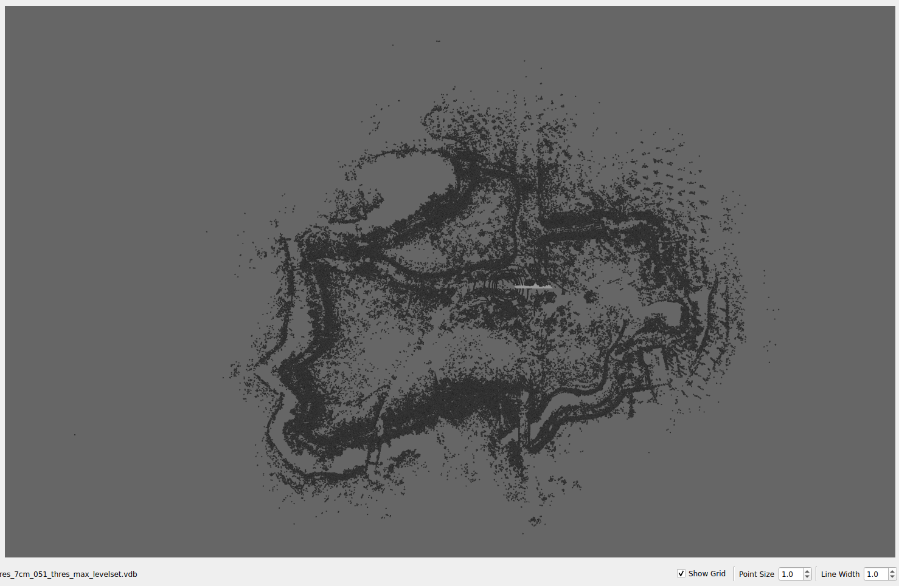

# Beluga VDB

## 🌐 Overview

BelugaVDB is a library extension for `beluga` that integrates [OpenVDB](https://www.openvdb.org/), enabling advanced 3D localization capabilities. Currently, this extension uses OpenVDB to efficiently process 3D maps and pointcloud data.

## 🔰 Mapping

BelugaVDB requires **level-set** maps in `vdb` format in order to work properly. VDB maps can be generated using suitables third party packages such as [VDB Mapping](https://github.com/fzi-forschungszentrum-informatik/vdb_mapping), but the resulting map must be converted to a level-set map.

A simple post-processing code for adapting a map generated by VDB Mapping into a `vdb` level-set map is shown below:

```cpp
#include <openvdb/openvdb.h>
#include <openvdb/tools/TopologyToLevelSet.h>

int main()
{
    openvdb::initialize();

    // Create a VDB file object.
    openvdb::io::File file("vdb_mapping_map.vdb");

    // Open the file.  This reads the file header, but not any grids.
    file.open();

    // Print the names of the grid
    for (openvdb::io::File::NameIterator nameIter = file.beginName(); nameIter != file.endName(); ++nameIter)
    {
        std::cout << "Grid name: " << nameIter.gridName() << std::endl;

    }

    // Retrieve a shared pointer
    openvdb::GridBase::Ptr baseGrid;
    baseGrid = file.readGrid("[0]");

    // Close the file
    file.close();

    // Cast the generic grid pointer to a FloatGrid pointer.
    openvdb::FloatGrid::Ptr grid = openvdb::gridPtrCast<openvdb::FloatGrid>(baseGrid);

    // Transform to level set
    openvdb::FloatGrid::Ptr grid_levelset = nullptr;
    grid_levelset = openvdb::tools::topologyToLevelSet(*grid, 3, 1, 0, 0);

    // Save new grid
    openvdb::io::File("levle_set_map.vdb").write({grid_levelset});
}
```

Also, `vdb` level-set maps can be generated from `pcd` maps (created from SLAM libraries such as [FAST-LIO](https://github.com/hku-mars/FAST_LIO)).

A simple code to generate a `vdb` level-set map from a `pcd` file is shown below:

```cpp
#include <openvdb/openvdb.h>
#include <openvdb/tree/Tree.h>
#include <openvdb/tools/TopologyToLevelSet.h>
#include <openvdb/math/Transform.h>

#include <pcl/io/pcd_io.h>
#include <pcl/point_types.h>

#include <iostream>

int main()
{
    openvdb::initialize();

    pcl::PointCloud<pcl::PointXYZ>::Ptr cloud (new pcl::PointCloud<pcl::PointXYZ>);

    // Open PCD file
    if (pcl::io::loadPCDFile<pcl::PointXYZ> ("map.pcd", *cloud) == -1) //* load the file
    {
        PCL_ERROR ("Couldn't read file map.pcd \n");
        return (-1);
    }
    std::cout << "Loaded cloud succesfuly"<< std::endl;


    // Create VDB grid of resolution 0.5
    openvdb::FloatGrid::Ptr grid = openvdb::FloatGrid::create();
    grid->setTransform(openvdb::math::Transform::createLinearTransform(0.5));
    grid->setGridClass(openvdb::GRID_LEVEL_SET);

    // Get an accessor for coordinate-based access to voxels.
    openvdb::FloatGrid::Accessor accessor = grid->getAccessor();

    // Fill the grid
    for (const auto& point: *cloud)
    {
        // World coordinates
        openvdb::Vec3f world_vect(point.x, point.y, point.z);

        // Transform to index world
        openvdb::math::Transform transform;
        openvdb::math::Coord ijk = transform.worldToIndexCellCentered(world_vect);

        // Set the voxel to 1
        accessor.setValue(ijk, 1.0);
        // Activate the voxel
        accessor.setActiveState(ijk);
    }

    // Transform to level set
    openvdb::FloatGrid::Ptr grid_levelset = nullptr;
    grid_levelset = openvdb::tools::topologyToLevelSet(*grid, 3, 1, 0, 0);

    // Name the grid "Map".
    grid_levelset->setName("Map");

    // Save new grid
    openvdb::io::File("pcdgrid.vdb").write({grid_levelset});
}
```

The resulting level-set maps can be visualize using [OpenVDBViewer](https://github.com/JimJam42/OpenVDBViewer).



## 📦 External Dependencies

### OpenVDB

For Ubuntu 24.04 and newer distributions, OpenVDB can be installed using `apt`:

```bash
sudo apt install libopenvdb-dev
```

For older distributions, it must be installed from sources as follows:

#### Step 1: Download OpenVDB

Clone [OpenVDB](https://github.com/AcademySoftwareFoundation/openvdb) into your machine (for Jammy version 8.2.0 is recommended):

```bash
git clone -b v8.2.0 https://github.com/AcademySoftwareFoundation/openvdb.git
```

#### Step 2: Compile OpenVDB

Now you need to build OpenVDB:

```bash
cd openvdb && \
mkdir build && cd build && \
cmake .. && \
make -j$(nproc)
```

#### Step 3: Install OpenVDB

You can now install OpenVDB using:

```bash
sudo make install
```

> [!NOTE]
> For more information about OpenVDB please refer to the [official documentation](https://www.openvdb.org/documentation/doxygen/).
