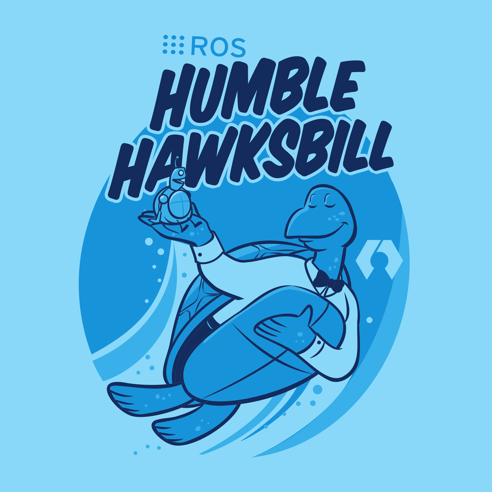
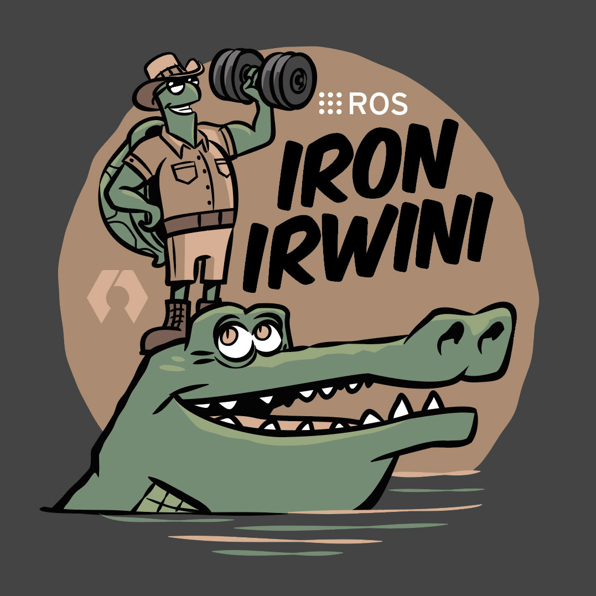
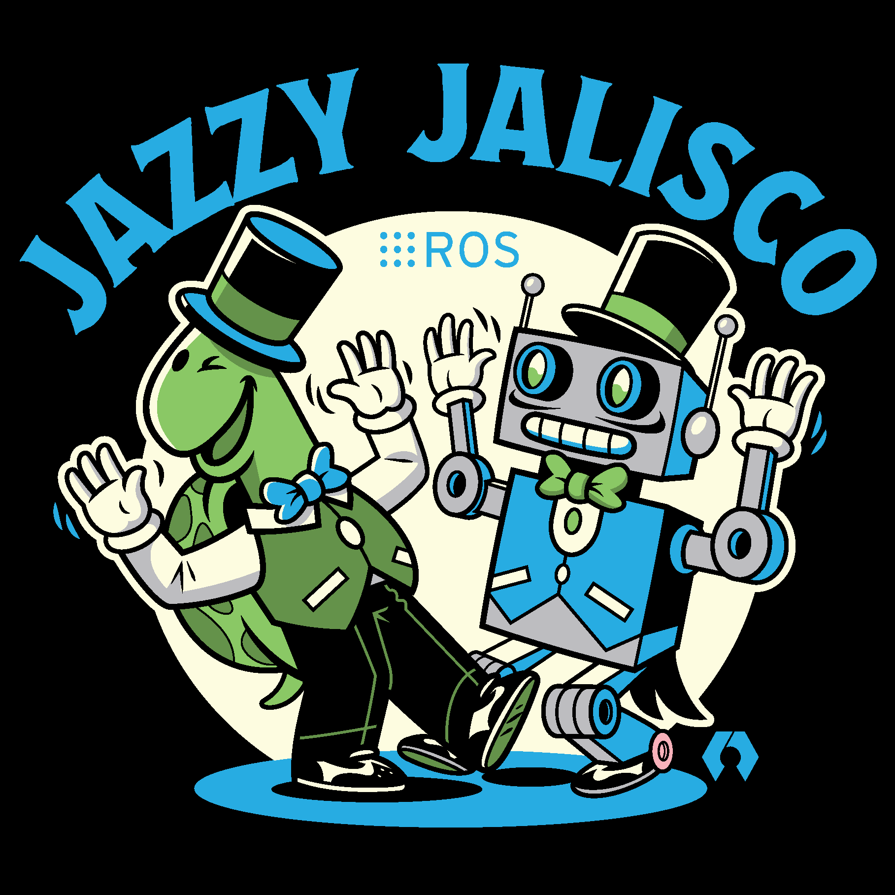

<!--
Copyright 2024 Ekumen, Inc.

Licensed under the Apache License, Version 2.0 (the "License");
you may not use this file except in compliance with the License.
You may obtain a copy of the License at

    http://www.apache.org/licenses/LICENSE-2.0

Unless required by applicable law or agreed to in writing, software
distributed under the License is distributed on an "AS IS" BASIS,
WITHOUT WARRANTIES OR CONDITIONS OF ANY KIND, either express or implied.
See the License for the specific language governing permissions and
limitations under the License.
-->

```{image} _images/logo_with_name_dark.png
:class: only-dark
:alt: Shows Beluga logo.
```

```{image} _images/logo_with_name_light.png
:class: only-light
:alt: Shows Beluga logo.
```

---

[](https://github.com/Ekumen-OS/beluga/actions/workflows/ci_pipeline.yml?query=branch:main)
[](https://codecov.io/gh/Ekumen-OS/beluga)
[](https://github.com/pre-commit/pre-commit)
[](https://github.com/Ekumen-OS/beluga/blob/main/LICENSE)

# Overview

```{toctree}
:hidden:
:maxdepth: 1
:caption: Getting started

getting-started/installation
getting-started/quickstart
```

```{toctree}
:hidden:
:maxdepth: 1
:caption: Concepts

concepts/key-concepts
concepts/design-principles
concepts/architecture
```

```{toctree}
:hidden:
:maxdepth: 1
:caption: Guides

guides/using-beluga-amcl
guides/extending-beluga
guides/profiling-beluga
guides/benchmarking-beluga
```

```{toctree}
:hidden:
:maxdepth: 1
:caption: Tutorials

tutorials/particle-filtering
tutorials/nav2-integration
```

```{toctree}
:hidden:
:maxdepth: 1
:caption: Packages

beluga <packages/beluga/docs/index>
beluga_ros <packages/beluga_ros/docs/index>
beluga_amcl <packages/beluga_amcl/docs/index>
```

```{toctree}
:hidden:
:maxdepth: 1
:caption: Roadmap

roadmap/features
roadmap/releases
```

```{toctree}
:hidden:
:maxdepth: 1
:caption: Resources

resources/bibliography
```

```{toctree}
:hidden:
:maxdepth: 1
:caption: About

about/rationale
about/contact
```

Beluga is an open source toolkit for Monte Carlo Localization (MCL), with a strong focus on code quality and performance.

:::{figure} ./_images/beluga_andino.gif
:alt: Short video of Andino running Beluga.

Beluga AMCL running on an [Andino](https://github.com/Ekumen-OS/andino) robot (Raspberry Pi 4B).
:::

## Features

- Bootstrap particle filtering
- Adaptive resampling policies
- Motion models for wheeled robots
- Sensor models for 2D rangers
- ROS 1 and ROS 2 integration

## Support

Beluga is supported on a number of ROS 1 and ROS 2 distributions, primarily on Linux platforms:

::::{grid}
:::{grid-item-card} ROS 1 Noetic Ninjemys
:text-align: center

:::
:::{grid-item-card} ROS 2 Humble Hawksbill
:text-align: center

:::
:::{grid-item-card} ROS 2 Iron Irwini
:text-align: center

:::
:::{grid-item-card} ROS 2 Jazzy Jalisco
:text-align: center

:::
::::

See [REP-0003](https://ros.org/reps/rep-0003.html) and  [REP-2000](https://www.ros.org/reps/rep-2000.html) for further reference on target platforms and support timelines.
